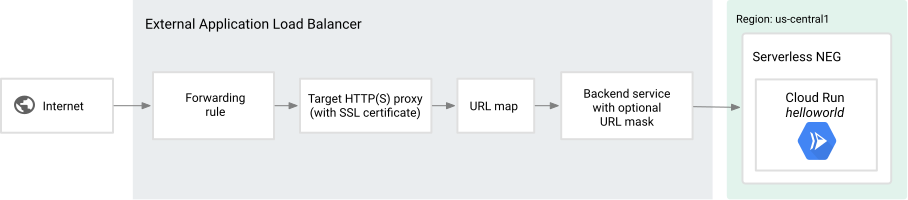
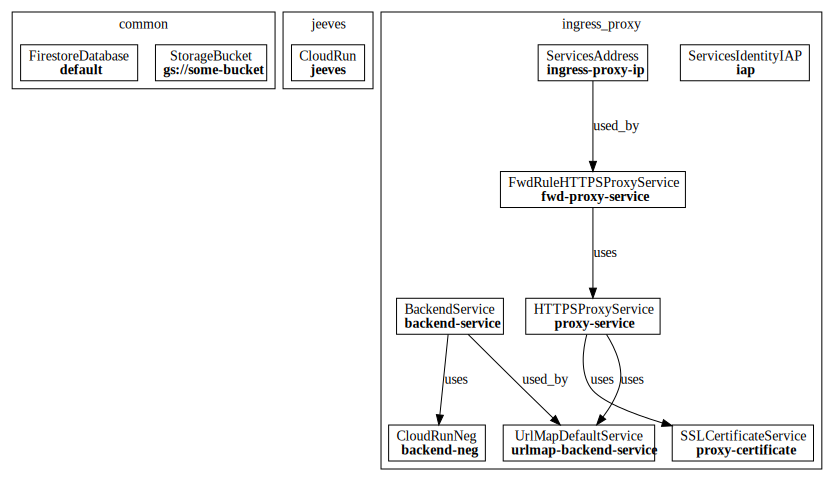

The following code deploys a pattern ressembling this one (see [link](https://cloud.google.com/load-balancing/docs/https/setting-up-https-serverless)):




```python
#!/usr/bin/env python3
"""
Infrastructure builder

@author: jldupont
"""
import logging
import sys
from functools import partial
from pygcloud.constants import Instruction
from pygcloud.models import EnvParam, EnvValue, LazyEnvValue, service_groups, LazyAttrValue
from pygcloud.gcp.services.storage import StorageBucket
from pygcloud.gcp.services.firestore import FirestoreDatabase, FirestoreIndexComposite
from pygcloud.gcp.services.run import CloudRun, CloudRunNeg
from pygcloud.gcp.services.identity import ServicesIdentityIAP
from pygcloud.gcp.services.iam import IAMBinding, ServiceAccount, IAMBindingService
from pygcloud.gcp.services.projects import ProjectIAMBindingService
from pygcloud.gcp.services.addresses import ServicesAddress
from pygcloud.gcp.services.backend import BackendService, BackendServiceAddNeg
from pygcloud.gcp.services.urlmap import UrlMapDefaultService
from pygcloud.gcp.services.certificate import SSLCertificateService
from pygcloud.gcp.services.proxies import HTTPSProxyService
from pygcloud.gcp.services.fwd_rules import FwdRuleHTTPSProxyService
from pygcloud.gcp.services.services import ServiceEnable
from pygcloud.gcp.models import BackendServiceSpec, BackendGroup, FwdRule, IPAddress
from pygcloud.deployer import Deployer
from pygcloud.policer import Policer, PolicyProjectLevelBindings
from pygcloud.tools import cd, cp, cptree, ls, mkdir
from pygcloud.gcp.models import RefUses
from pygcloud.grapher import Grapher

try:
    # for local development because
    from dotenv import load_dotenv
    load_dotenv() 
except:
    pass

logging.basicConfig(level=logging.DEBUG)
logger = logging.getLogger("builder")
info = logger.info
debug = logger.debug
echo = info


#
# Which group of services to deploy
#
srv_group_name = EnvValue("_SRV_GROUP", default="common")

# Environment variables
PROJECT_ID = EnvValue("_PROJECT_ID")
PROJECT = EnvParam("--project", "_PROJECT_ID")
BRANCH_NAME = EnvValue("BRANCH_NAME", default="dev").lower()

if BRANCH_NAME == "prod":
    DOMAIN_NAME = EnvValue("_DOMAIN_PROD")
else:
    DOMAIN_NAME = EnvValue("_DOMAIN")


info(f"Starting deployment with pygcloud: group({srv_group_name}) project({PROJECT_ID})")

REGION = LazyEnvValue("_REGION")
DB_NAME = "(default)"
DB_LOC = "northamerica-northeast1"
BLOBS_BUCKET_NAME = EnvValue("_BLOBS_BUCKET")
BLOB_MOUNT_PATH = "/tmp/_blobs"
INGRESS_PROXY_IP_ADDRESS_NAME = "ingress-proxy-ip"
INGRESS_BACKEND_NAME="backend-service"
BACKEND_NEG="backend-neg"
URLMAP_NAME="urlmap-backend-service"
CERTIFICATE_NAME="proxy-certificate"
HTTPS_PROXY_NAME="proxy-service"
FWD_HTTPS_PROXY_NAME=f"fwd-{HTTPS_PROXY_NAME}"


#
# Dependency to "common" and "jeeves"
#
sa_jeeves = ServiceAccount("jeeves", PROJECT_ID)


# Common ==
# =========

srv_group_common = service_groups.create("common")

#
# Storage related
#
storage_enable = ServiceEnable(StorageBucket)
srv_group_common.append(storage_enable)

srv_group_common.append(sa_jeeves)


bucket = StorageBucket(BLOBS_BUCKET_NAME, 
                       params_create = ["--public-access-prevention"],
                       params_update = ["--public-access-prevention"])

srv_group_common.append(bucket)

jeeves_binding_for_bucket = IAMBinding(ns="serviceAccount",
                            email=LazyAttrValue(sa_jeeves, "spec.email"),
                            role="roles/storage.objectUser"
                            )
jeeves_binding_to_bucket = IAMBindingService(bucket, jeeves_binding_for_bucket)
srv_group_common.append(jeeves_binding_to_bucket)

#
# Firestore Database related
#
firestore_enable = ServiceEnable("firestore.googleapis.com")
srv_group_common.append(firestore_enable)

db = FirestoreDatabase(DB_NAME, params_create=[
    "--location", DB_LOC
])

srv_group_common.append(db)

jeeves_binding_for_firestore = IAMBinding(ns="serviceAccount",
                            email=LazyAttrValue(sa_jeeves, "spec.email"),
                            role="roles/datastore.user"
                            )

bs = ProjectIAMBindingService(jeeves_binding_for_firestore, PROJECT_ID)
PolicyProjectLevelBindings.allow(bs, "Firestore does not accept direct bindings")
srv_group_common.append(bs)

db_index = FirestoreIndexComposite(DB_NAME, params_create=[
        "--collection-group", "files_metadata_v4",
        "--field-config", "field-path=creator.email,order=ascending",
        "--field-config", "field-path=creation.iso_str,order=descending",
        "--field-config", "field-path=__name__,order=descending"
])

srv_group_common.append(db_index)

# Jeeves ==
# =========

srv_group_jeeves = service_groups.create("jeeves")

def prepare_for_jeeves():
    echo("Preparing files for Jeeves")

    mkdir("/tmp/builder")

    cp("/workspace/infra/components/jeeves/Dockerfile", "/tmp/builder/Dockerfile")
    cptree("/workspace/components/jeeves", "/tmp/builder/app")
    cptree("/workspace/libs/lib_jld", "/tmp/builder/libs")

    cd("/tmp/builder")

    ls()
    ls("app")
    ls("libs")

srv_group_jeeves.append(prepare_for_jeeves)

run_enable = ServiceEnable("run.googleapis.com")
srv_group_jeeves.append(run_enable)

srv_group_jeeves.append(sa_jeeves)

cr = CloudRun("jeeves", [
    "--source", ".",
    "--no-allow-unauthenticated",
    "--ingress", "internal-and-cloud-load-balancing",
    "--memory", LazyEnvValue("_MEMORY"),
    "--execution-environment", "gen2",
    "--add-volume", f"name=blobs,type=cloud-storage,bucket={BLOBS_BUCKET_NAME}",
    "--add-volume-mount", f"volume=blobs,mount-path={BLOB_MOUNT_PATH}",
    "--set-env-vars", f"BLOB_MOUNT_PATH={BLOB_MOUNT_PATH}",
    "--command", "/app/run.sh"
], region=REGION)

cr.service_account = sa_jeeves
srv_group_jeeves.append(cr)


# Ingress ==
# ==========

srv_group_ingress = service_groups.create("ingress_proxy")

#
# IAP service with its service account
#     bound to the run.invoker role
#
iap_sa = ServicesIdentityIAP()
srv_group_ingress.append(iap_sa)

# Add run invoker role to IAP
binding = IAMBinding(ns="serviceAccount", 
                        email=LazyAttrValue(iap_sa, "sa_email"),
                        role="roles/run.invoker"
                        )

iap_to_cr_binding = IAMBindingService(cr, binding)
srv_group_ingress.append(iap_to_cr_binding)

#
# Fixed IP address for the external load balancer
#
srv_ip_address = ServicesAddress(name=INGRESS_PROXY_IP_ADDRESS_NAME)
srv_group_ingress.append(srv_ip_address)

# IP_ADDRESS_PROXY = LazyAttrValue(srv_ip_address, "address")

#
# Backend Service for the external load balancer
#

srv_backend = BackendService(INGRESS_BACKEND_NAME, [
    "--global"  # describe params
],[
    "--global", # create params
    "--load-balancing-scheme", "EXTERNAL_MANAGED"
])
srv_group_ingress.append(srv_backend)

#
# We have a dependence on the CloudRun for the ingress proxy
# The backend Cloud Run service needs to be deployed before
# being able to successfully attach an external load balancer
# with a certificate
#
def get_cloud_run_url(cr):

    # This will only invoke the 'describe' method
    # The cloud run revision spec will be captured
    cr.set_just_describe()


srv_group_ingress.append(partial(get_cloud_run_url, cr))
srv_group_ingress.append(cr)

neg = CloudRunNeg(BACKEND_NEG, [
    "--cloud-run-service", LazyAttrValue(cr, "spec.status.url")
], region=REGION)

srv_group_ingress.append(neg)

#
# The backend network endpoint group (NEG)
# 
# This is required for accessing a serverless
# Cloud Run based backend
#
def maybe_connect_backend_to_neg():
    """Check if backend is connected to NEG already
       and abort this step if it is

       "group": \
        "https://www.googleapis.com/compute/v1/projects/PROJECT"
            "/regions/REGION/networkEndpointGroups/backend-neg"
    """
    be_spec:BackendServiceSpec = srv_backend.spec
    group: BackendGroup
    already_connected = False

    for group in be_spec.backends:

        ref_uses: RefUses = group.group
        
        if "networkEndpointGroups" in ref_uses.service_type:
            if BACKEND_NEG in ref_uses.name:
                already_connected = True
                break

    if already_connected:
        return Instruction.ABORT_DEPLOY


srv_be_connect_to_neg = BackendServiceAddNeg(INGRESS_BACKEND_NAME,
                                             neg_name=BACKEND_NEG,
                                             region=REGION)

srv_be_connect_to_neg.add_task_before_deploy(maybe_connect_backend_to_neg)

srv_group_ingress.append(srv_be_connect_to_neg)


#
# External Load Balancer URL Map
#  connecting to the backend service
#

srv_url_map = UrlMapDefaultService(URLMAP_NAME, INGRESS_BACKEND_NAME)
srv_group_ingress.append(srv_url_map)

#
# The SSL certificate
#
srv_ssl_certificate = SSLCertificateService(CERTIFICATE_NAME, DOMAIN_NAME)
srv_group_ingress.append(srv_ssl_certificate)

#
# The actual external load balancer (aka proxy)
#
srv_proxy = HTTPSProxyService(HTTPS_PROXY_NAME, CERTIFICATE_NAME, URLMAP_NAME)
srv_group_ingress.append(srv_proxy)

srv_fwd_rule = FwdRuleHTTPSProxyService(FWD_HTTPS_PROXY_NAME,
                                        HTTPS_PROXY_NAME,
                                        INGRESS_PROXY_IP_ADDRESS_NAME)
srv_group_ingress.append(srv_fwd_rule)

#
# Consistency check because
#
def check_fwd_rule():
    """
    Make sure the forwarding rule is really applied
    at the IP address of the proxy

    It is not sufficient to check if the FwRule exists
    because the infrastructure might have been manually changed
    """
    global srv_ip_address
    global srv_fwd_rule
    global HTTPS_PROXY_NAME

    spec_address: IPAddress = srv_ip_address.spec
    spec_rule: FwdRule = srv_fwd_rule.spec

    def exit(msg):
        logging.error(f"Fwd rule error: {msg}")
        sys.exit(1)

    if spec_address.address != spec_rule.IPAddress:
        exit("IP address mismatch")

    target: RefUses = spec_rule.target

    if not "targetHttpsProxies" in target.service_type:
        exit("Unexpected service type")

    if not HTTPS_PROXY_NAME in target.name:
        exit("backend target mismatch")

    info("FwdRule checks out")


srv_group_ingress.append(check_fwd_rule)

#
# Policing phase
#
Policer.police()

# Only deploy the group specified through the build process
#
deployer = Deployer(common_params=[PROJECT])

#
# The actual deployment tasks happen here
#
deployer.deploy(srv_group_name)

graph = Grapher.graph
print(graph)

```

# Example output

```
(venv) (base) jldupont@jldupont:~/workspace/playground$ make ingress
Deploying ingress_proxy ...
INFO:builder:Starting deployment with pygcloud: group(ingress_proxy) project(PROJECT)
WARNING:root:The service 'ProjectIAMBindingService(IAMBinding(email=LazyAttrValue(ServiceAccount, spec.email), role='roles/datastore.user', ns='serviceAccount'), PROJECT)' was allowed by default on policy 'PolicyProjectLevelBindings', reason= Firestore does not accept direct bindings
WARNING:root:Policy '<class 'pygcloud.policies.PolicyServiceAccount'>' allows service 'ProjectIAMBindingService(IAMBinding(email=LazyAttrValue(ServiceAccount, spec.email), role='roles/datastore.user', ns='serviceAccount'), PROJECT)'. Skipping.
WARNING:root:Policy '<class 'pygcloud.policies.PolicyProjectLevelBindings'>' allows service 'ProjectIAMBindingService(IAMBinding(email=LazyAttrValue(ServiceAccount, spec.email), role='roles/datastore.user', ns='serviceAccount'), PROJECT)'. Skipping.
INFO:root:> Policer: outcome: PolicingResult(service=ProjectIAMBindingService(IAMBinding(email=LazyAttrValue(ServiceAccount, spec.email), role='roles/datastore.user', ns='serviceAccount'), PROJECT), policy=<class 'pygcloud.policies.PolicyProjectLevelBindings'>, violation=None, raised=False, passed=False, allowed=True)
INFO:pygcloud.deployer:Before deploying iap:iap
INFO:pygcloud.deployer:Before deploying iam_binding:CloudRun
INFO:pygcloud.deployer:Before deploying ip:ingress-proxy-ip
INFO:pygcloud.deployer:Before deploying be:backend-service
INFO:pygcloud.deployer:Before deploying run:jeeves
INFO:pygcloud.deployer:Before deploying crneg:backend-neg
INFO:pygcloud.deployer:Before deploying be:backend-service
INFO:pygcloud.deployer:Before deploying urlmap:urlmap-backend-service
INFO:pygcloud.deployer:Before deploying ssl:proxy-certificate
INFO:pygcloud.deployer:Before deploying https-proxy:proxy-service
INFO:pygcloud.deployer:Before deploying fwd-rule:fwd-proxy-service
INFO:builder:FwdRule checks out
```

# Diagram Sample


