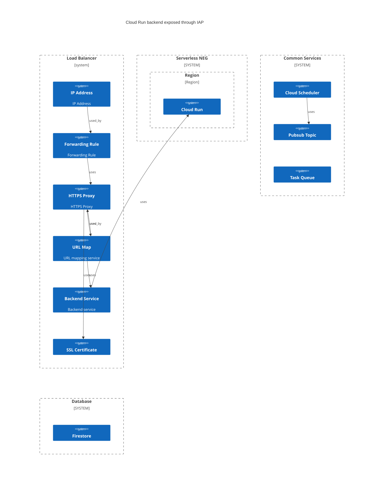

Much information is available to `pygcloud` when it is used to police and deploy infrastructure. This information can be used to build a graph of the services (nodes) and relationships (edges) between them.

# Available Information

* Service
  * Class (e.g. Cloud Run)
  * Name

There are different level of information available by service but the aforementionned are very common. Some resources do not have have names but only auto generated IDs (e.g. Firestore indexes): even in these cases, some valuable processes can be applied to them (e.g. policing).

* Relationships
  * "Has parent" (e.g. the service's parent project)
  * "Used by" (e.g. Backend service referring to a URL Map)
  * "Uses" (e.g. HTTPS Proxy uses URL Map)
  * "Member of" (e.g. pygcloud service group)

## IAM Bindings

The bindings provided information as to which service(s) (or application running on it) service accounts can perform on which other service(s). This information informs the `uses` relationship type.

## Explainability

Each reported relationship is labelled with a reference as to the `source`:

* From the service specification (gcloud ... describe)
* From the IAM bindings (project and service/resource levels)

# Relationships

The goal is to leverage the inherent relationships between GCP services as much as possible in order to limit the burden already imposed building the infrastructure.

The usage of the `policing` function can help surface more information: a good example is forcing the use of dedicated service accounts on compute related services and service level IAM bindings compared to using default (GCP provided) service accounts.

The only supported relation type is unidirectional.

The only non-native relation supported at the moment is `service group` used at deployment time.

## Used By

Why keep the "USED_BY" relation type as opposed to just exchanging nodes in an edge definition ?
It is to preserve the explicit information out of GCP as much as possible without performing
transformation to it.

# Grouping

The "group" construct is abstract by nature. Support for grouping is done through the `ServiceGroup` class. It is quite generic and open for extension.

## User defined groups

```python
srv = StorageBucket(...)

# Some other tyoe of logical grouping for operational purposes maybe ?
group = ServiceGroups.create("my-group")
group.append(srv)

# One of the goals is should actually to deploy this service too
deployment_group_common = ServiceGroups.create("common")
deployment_group_common.append(srv)
```

## GCP data model

The service specification defines the following fields as "edges":

* `selfLink` : serves as the fully qualified name for the service `node`
* `target`: a field to identify an end of an edge
* `users`: a list of nodes
* `usedBy`: a list of nodes
* `group`: sometimes used to hold links e.g. NEGs
* 'pubsubTarget': reference to a `topicName`

The `usedBy` attribute sometimes contains a list of dict with key 'reference'.

## Mapping to an internal model

| gcp      | pygcloud |
| --       | --       |
| selfLink | selfLink |
| target   | uses     |
| users    | used_by  |
| usedBy   | used_by  |
| group    |   |


# API in support of graphing

A generator based API is provided.

# Examples



TODO

# Future considerations

* Support for declaring non-native relationships (e.g. grouping of services differently than deployment level)
* Support for declaring external services and resources

